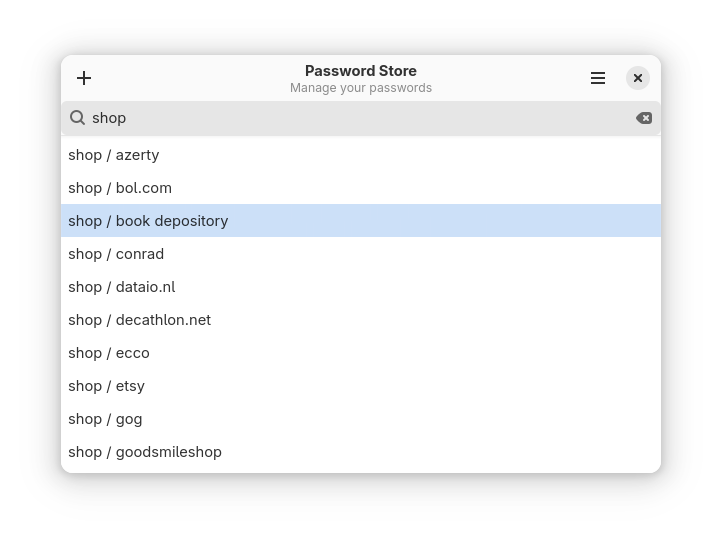

# Password Store for GNOME

A lightweight GTK4 front‑end for **pass**, written in Rust and distributed as a Flatpak.



## Project Rationale

Immutable desktop operating systems—such as Fedora Silverblue and other image‑based distributions, often omit the `pass` command‑line tool. Adding it usually requires layering additional packages or weakening the system’s read‑only guarantees. Packaging Password Store for GNOME as a Flatpak provides full *pass* functionality without modifying the host system.

This application delivers a GNOME‑native experience while remaining fully compatible with the standard `~/.password-store` directory used by *pass*.

## Features

* **Technology stack**: Rust, GTK4/libadwaita, Flatpak, Git, GnuPG
* **File format compatibility**: Reads and writes the exact `~/.password-store` hierarchy
* **Desktop integration**: GNOME Shell search provider, clipboard support, Git synchronisation over SSH
* **Security**: Secrets remain encrypted on disk (GPG) and are decrypted only in memory upon request

## Project Goals

1. **Native GNOME experience** — behaviour consistent with other GNOME applications.
2. **Offline operation** — all core functionality (CRUD Encrypted files) works without network access.
3. **Minimal dependencies** — no need for external libraries or tools beyond the Flatpak runtime.

## Building and Running

### Prerequisites

* **GNOME Builder** 47 or later (recommended) — automatically installs the required Flatpak SDK.
* **Flatpak** with the GNOME 47 runtime and the Rust stable extension:

```bash
flatpak install org.gnome.Sdk//47 org.freedesktop.Sdk.Extension.rust-stable
```

### Development workflow in GNOME Builder

1. Clone or open the project in GNOME Builder.
2. Select the *Flatpak* build target.
3. Press **Run** to build and start the application in a sandbox.

## Contributing

Issues, feature requests, and pull requests are welcome. If you plan to introduce a substantial change, please open an issue first to discuss the proposed approach.
