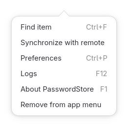
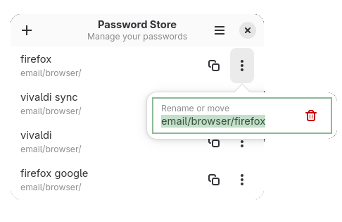
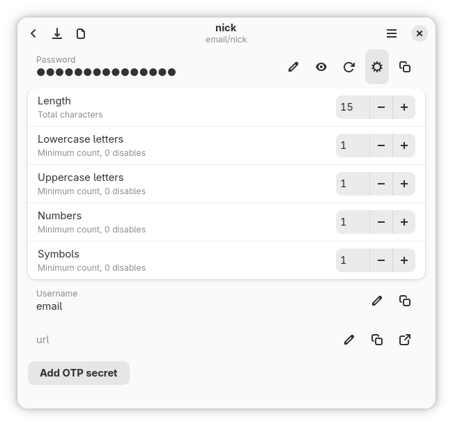

[](https://github.com/noobping/PasswordStore/actions/workflows/linux.yml)

# Password Store

A modern Rust-based password manager for Linux, built with GTK4/Libadwaita.

A graphical frontend for the `pass` password store with the goal of offering **feature parity with QtPass**, but with a **modern, responsive Adwaita/GTK4 UI** that works great on both **desktop and mobile Linux**.

## Features

- Uses the existing [`pass`](https://www.passwordstore.org/) command-line password store
<!-- - Or use the integrated backend via [`ripasso`](https://crates.io/crates/ripasso) (no external `pass` binary required) -->
- Can run as a **standalone/local app** or **system-wide install**
- Optional built-in installer/uninstaller for local setups
- Written in Rust, using GTK4 + Libadwaita
- Responsive layout for desktop and mobile form factors

## Screenshots








## Cargo Features

```text
setup = For built-in installer/uninstaller
libripasso = For the integrated backend
```

## Development dependencies

Install development dependencies:

```sh
sudo dnf install gpgme-devel clang pkg-config nettle-devel libgpg-error-devel openssl-devel \
    gtk4-devel gcc pkgconf-pkg-config \
    glib2-devel cairo-devel pango-devel libadwaita-devel
```
