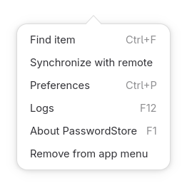
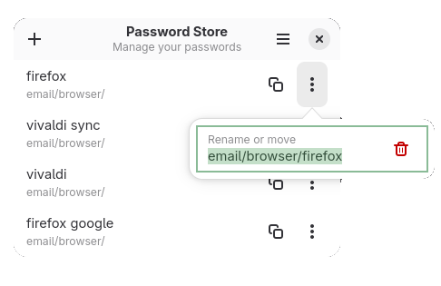

[](https://github.com/noobping/PasswordStore/actions/workflows/linux.yml)

# Password Store

A modern Rust-based password manager for Linux, built with GTK4/Libadwaita.

A graphical frontend for the `pass` password store with the goal of offering feature parity with QtPass, but with a modern, responsive Adwaita/GTK4 UI that works great on both desktop and mobile Linux.

## Features

- Uses the existing [`pass`](https://www.passwordstore.org/) command-line password store
- Can run as a standalone/local app
- Written in Rust, using GTK4 + Libadwaita
- Responsive layout for desktop and mobile form factors

## App versions

There are some differences between the build versions.

The Flatpak application has built-in key management, which reduces the number of external dependencies as much as possible.

The AppImage version only bundles the `pass` command. The standalone application can either use a custom `pass` command available on the host system or the built-in backend. However, it still relies on the system’s key management instead of using its own key management implementation.

## Screenshots






## Cargo Features

```text
setup = For built-in installer/uninstaller and backend selection
flatpak = Build for a containerised env.
```

## Development dependencies

Install development dependencies:

```sh
sudo dnf install gpgme-devel clang pkg-config nettle-devel libgpg-error-devel openssl-devel \
    gtk4-devel gcc pkgconf-pkg-config \
    glib2-devel cairo-devel pango-devel libadwaita-devel \
    cargo mold pass pass-otp pinentry pinentry-gnome3 python-pass-import pass-audit
```
