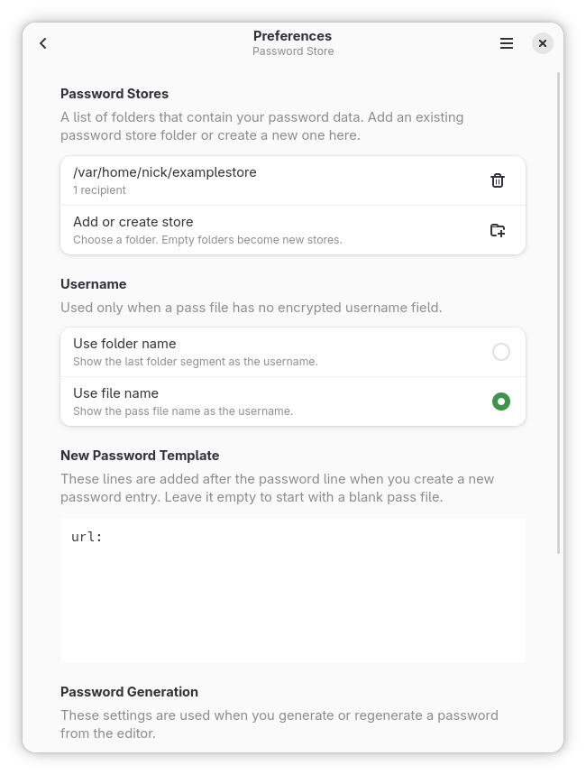
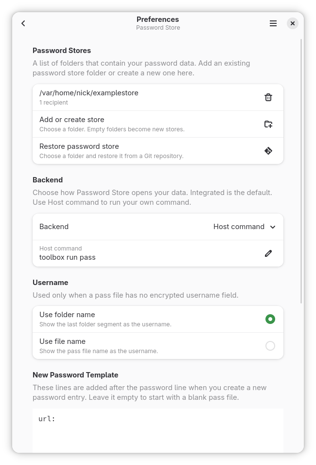

# Password Store


[](https://github.com/noobping/PasswordStore/actions/workflows/linux.yml)

Password Store is a app for people who use the standard Unix password manager [`pass`](https://www.passwordstore.org/).

if your passwords already live in a `pass` store, this project gives you a clean graphical app to browse, search, copy, edit, and organize them.

It is:

- a (local) Linux application
- written in Rust
- built with GTK4 and Libadwaita
- designed around the existing `pass` ecosystem, not around a separate cloud account

It is not:

- a hosted password service
- a browser extension

## What You Can Do With It

- Browse and search passwords across one or more password stores
- Create new entries and edit existing ones
- Copy passwords, usernames, OTP codes and other values to the clipboard
- Edit entries as structured fields or as the raw pass file
- Generate passwords with configurable rules
- Rename, move, delete, and undo recent changes
- Open URLs stored inside entries
- Manage store recipients in `.gpg-id` in a graphical way
- Create new stores or add existing ones
- Clone and sync Git-backed stores (not in the flatpak build)
- Import passwords from other password managers through `pass import` when that extension is available

## Why This Project Exists

`pass` is powerful, simple, and scriptable, but it can feel rough for people who want a normal app window.
This project aims to keep the good parts of `pass`:

- plain files
- GPG-based encryption
- Git-friendly storage
- ownership of your own data

while making day-to-day use easier:

- faster browsing
- easier editing
- friendlier store setup
- built-in search
- touch-friendly GTK4/Adwaita UI

## How It Works

Password Store reads and writes standard `pass` stores. On a normal build, it can work in two ways:

- `Integrated` backend: the app reads and writes the store directly. This is the default.
- `Host command` backend: the app runs your chosen `pass` command (wich can come from a Docker container if you want) instead.

That means:

- if you already use `pass`, your existing store layout still makes sense here
- you can keep using Git-backed stores
- you do not need to migrate your data into a new (proprietary) format

## Build Modes

There are a few important runtime differences depending on how you build the app.

| Build mode | Best for | Notes |
| --- | --- | --- |
| Standard build | Most Linux users and developers | Default build. Uses the integrated backend by default, can switch to a custom `pass` command in Preferences, supports Git clone/sync, and can use `pass import` when available. |
| `flatpak` feature | Sandboxed / Containerized environments | Uses the integrated backend only and includes built-in private-key management, avoiding external dependencies. |
| `setup` feature | Self-built installs | Adds an in-app action to add or remove the built binary from the app menu. |

## Feature Highlights

### Everyday use

- Search filters the list of entries as you type
- You can pass words on the command line to prefill that search
- The editor understands common structured fields like username and URL
- OTP secrets stored as `otpauth://...` can be shown as live one-time codes

### Store management

- Multiple store roots are supported
- Missing stores are automatically pruned from saved preferences
- New stores can be created with recipients already set
- Existing stores can be added from disk

### Git support

In the standard build, the app can:

- clone a password store repository into a chosen folder
- sync configured Git-backed stores with `fetch --all`, `pull`, and `push`

When the integrated backend edits a store that is already a Git repository, it also commits entry and recipient changes automatically. That keeps local changes ready for the next sync.

### Import support

In the standard build, the app can surface import sources from `pass import --list` and run `pass import --convert` into the selected store.
So you can import your credentials from most existing wassword managers.

### Flatpak key management

In Flatpak builds, the app can:

- import private keys from a file
- detect whether a key needs a passphrase
- unlock a key for the current session
- use those managed keys while editing store recipients

## Screenshots

### Password entry editor


### Preferences in a Flatpak build



### Preferences in a standard build



## Development

You need Rust and the native development libraries for:

- GTK4
- Libadwaita
- GLib
- Cairo
- Pango
- OpenSSL
- Nettle
- libgpg-error
- GPGME
- `pkg-config`
- a working C toolchain

Package names differ by distribution. This project was tested with Fedora packages such as:

```sh
sudo dnf install gpgme-devel clang pkg-config nettle-devel libgpg-error-devel openssl-devel \
    gtk4-devel gcc pkgconf-pkg-config \
    glib2-devel cairo-devel pango-devel libadwaita-devel \
    cargo mold git pass pinentry pinentry-gnome3 python-pass-import \
    clippy rustfmt
```

### Running And Building

Run the default build:

```sh
cargo run
```

Build a release binary:

```sh
cargo build --release
```

Build with the optional local installer action:

```sh
cargo build --release --features setup
```

Build the Flatpak-oriented variant:

```sh
cargo build --release --features flatpak
```

Pass a startup search query:

```sh
cargo run -- github
```

### Project Layout

If you are reading the codebase, these folders matter most:

| Path | Purpose |
| --- | --- |
| `src/backend` | Reading, writing, deleting, renaming, and recipient management for password entries |
| `src/password` | Entry model, list loading, editor flow, OTP support, password generation, undo |
| `src/store` | Store creation, store list management, recipient editing, import flows |
| `src/window` | Main window, navigation, actions, preferences, Git UI, logs |
| `src/preferences` | Stored app settings such as backend choice, store paths, templates, and generator settings |
| `src/support` | Background-task helpers, UI helpers, Git helpers, and `pass import` support |
| `src/private_key` | Flatpak-only dialogs and flows for private-key unlocking |
| `data` | GTK UI definition, app metadata, icons, and resources |
