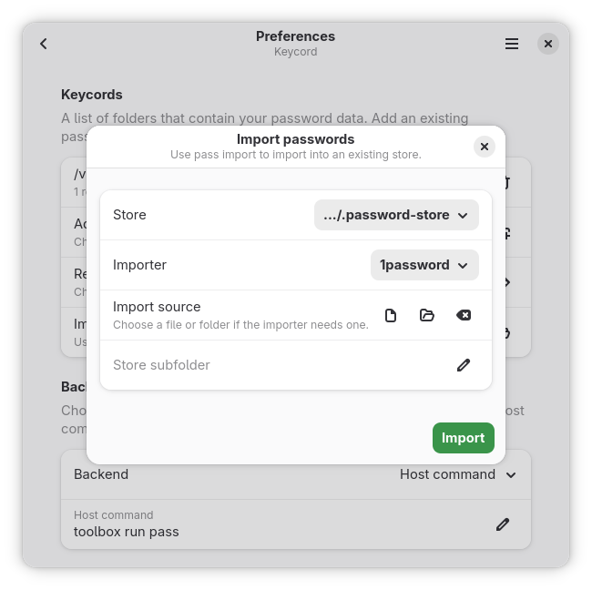
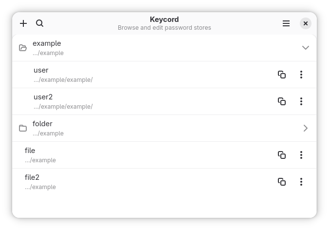
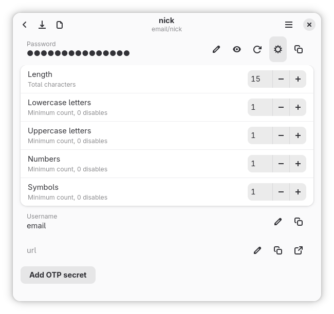

# Keycord


[](https://github.com/noobping/keycord/actions/workflows/linux.yml)

Keycord works with password stores that use the standard [`pass`](https://www.passwordstore.org/) layout, so existing data can stay in place and remain compatible with established workflows.

- Search entries across more than one store
- Work with structured fields or raw pass-file text
- Generate passwords and copy usernames, secrets, and one-time codes
- Manage recipients and private keys
- Clone and sync Git-backed stores
- Import passwords from other password managers through `pass import` when that extension is available

## How It Works

Keycord reads and writes standard `pass` stores. It can work in two ways:

- `Integrated` backend: the app reads and writes the store directly. This is the default.
- `Host command` backend: the app runs your chosen `pass` command.

## Screenshots







## Development

Package names differ by distribution. This project was tested with Fedora packages:

```sh
sudo dnf install gpgme-devel clang pkg-config nettle-devel libgpg-error-devel openssl-devel gtk4-devel gcc pkgconf-pkg-config glib2-devel cairo-devel pango-devel libadwaita-devel cargo mold clippy rustfmt \
    git pass pass-otp pinentry pinentry-gnome3 python-pass-import
```

### Running and Building

Run the default build:

```sh
cargo run
```

Build with the optional local installer action:

```sh
cargo build --release --features setup
```

### Cross compile

Build the container:

```sh
podman build -t rust-win -f Containerfile
```

Enter the container:

```sh
podman run --rm -it --userns=keep-id -v "$PWD":/work:z -w /work rust-win
```

Build inside the container:

```sh
cargo build --release --target x86_64-pc-windows-gnu
```
