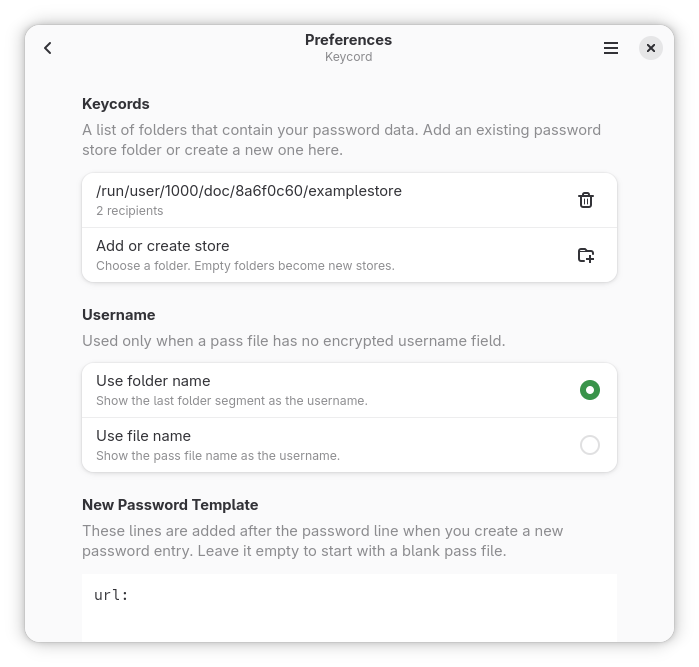

# Aan de slag

Keycord is een grafische app voor standaard `pass`-opslagen. Je hoeft je gegevens niet te converteren, en de interface is gemaakt voor toetsenbord, aanwijzer en aanraking op desktop- en mobiele Linux.

## Kernbegrippen

### Opslag

Een opslag is een map met versleutelde `pass`-bestanden en een `.gpg-id`-bestand. Als er niets anders is ingesteld, zoekt Keycord naar `~/.password-store`.

Je kunt meer dan één opslag toevoegen. Zoeken doorzoekt alle geconfigureerde opslagen.

### Pass-bestand

De eerste regel is het wachtwoord. Latere regels kunnen gestructureerde velden zijn:

```text
correct-horse-battery-staple
username: alice@example.com
email: alice@example.com
url: https://github.com/login
notes: personal account
```

Keycord behandelt deze regels speciaal:

- `username:`, `user:` en `login:` verwijzen naar het veld voor de gebruikersnaam
- `otpauth://...` of `otpauth: otpauth://...` wordt het OTP-veld
- andere `key: value`-regels worden doorzoekbare velden
- regels zonder dubbele punt blijven behouden als ruwe tekst, maar zijn geen gestructureerde zoekvelden

### Editors

- Standaardeditor: wachtwoord, gebruikersnaam, OTP en dynamische velden
- Ruwe editor: het volledige pass-bestand als tekst

## Backends

Keycord heeft twee backends:

- `Integrated`: leest en schrijft de opslag direct
- `Host`: voert je geconfigureerde `pass`-opdracht uit

Gebruik `Host` wanneer je dit nodig hebt:

- herstellen vanuit Git
- `pass import`
- een aangepaste `pass`-opdracht

Deze Host-functies zijn alleen beschikbaar op Linux. Als Host-functies in Flatpak zijn uitgeschakeld, zie [Machtigingen en backends](permissions-and-backends.md).

## Snel beginnen

### 1. Een opslag toevoegen

Open Voorkeuren met `Ctrl+,`.

- Voeg een bestaande `pass`-opslag toe als je er al een hebt.
- Kies een lege map als je een nieuwe opslag wilt.

Een nieuwe opslag heeft minstens één ontvanger nodig voordat die bruikbaar is.



### 2. Een backend kiezen

Gebruik `Integrated`, tenzij je Host-functies nodig hebt die alleen op Linux beschikbaar zijn.

### 3. Een item maken

Druk op `Ctrl+N` en voer een pad in zoals:

```text
personal/github
```

Keycord maakt een nieuw pass-bestand op basis van het huidige sjabloon voor nieuwe wachtwoorden.

### 4. Bewerken en opslaan

Vul de velden in die je nodig hebt:

- wachtwoord
- gebruikersnaam
- e-mail
- URL
- notities
- OTP-geheim

Sla op met `Ctrl+S`.


### 5. Zoeken

Druk op `Ctrl+F`.

Begin met gewoon zoeken:

```text
github
```

Probeer daarna gestructureerd zoeken:

```text
find user alice
find url contains github
find email is $username
```

Zie [Zoekgids](search.md) voor de volledige syntaxis.

### 6. Hulpmiddelen openen

Druk op `Ctrl+T`.

Veelgebruikte hulpmiddelen:

- **Veldwaarden bekijken**
- **Zwakke wachtwoorden vinden**
- **Wachtwoorden importeren** op Linux wanneer Host en `pass import` beschikbaar zijn

Open voor de ingebouwde handleidingen **Documentatie** vanuit het hoofdmenu of druk op `Ctrl+Shift+D`.

## Nieuwe opslag

Wanneer je een nieuwe opslag in een lege map maakt:

1. kies de map in **Wachtwoordopslagen**
2. open **Opslagsleutels**
3. voeg minstens één ontvanger toe
4. sla de ontvangers op

Keycord schrijft `.gpg-id`. Als de opslag geen Git-metadata heeft, initialiseert Keycord ook een Git-repository.

## Herstellen vanuit Git

**Wachtwoordopslag herstellen** is een Host-functie die alleen op Linux beschikbaar is.

Vereisten:

- Linux-build
- Host-backend
- hosttoegang in Flatpak
- een lokale doelmap
- een Git-repository-URL

Stappen:

1. open **Wachtwoordopslagen**
2. kies **Wachtwoordopslag herstellen**
3. kies de map
4. voer de repository-URL in

## Starten met een zoekopdracht

Keycord gebruikt alle opdrachtregelargumenten als initiële zoekopdracht.

Voorbeelden:

```sh
keycord github
keycord find user alice
keycord 'reg:(?i)^work/.+github$'
```

## Verder lezen

- [Zoekgids](search.md)
- [Werkstromen](workflows.md)
- [Machtigingen en backends](permissions-and-backends.md)
